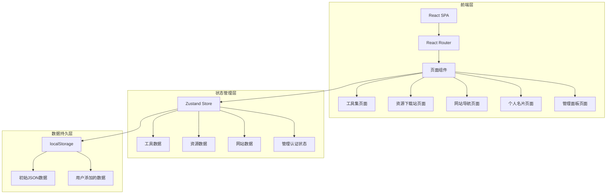
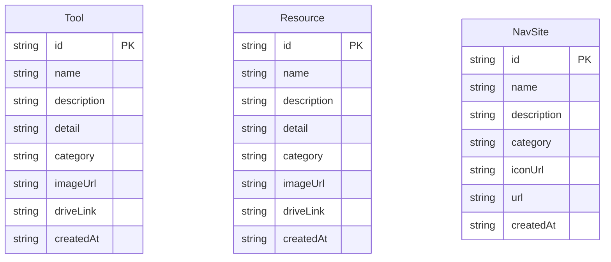

## 1. 架构设计



## 2. 技术说明

- **前端框架**：React 18 + TypeScript + Vite
- **样式方案**：Tailwind CSS 3
- **状态管理**：Zustand（管理工具/资源/网站数据及认证状态）
- **路由**：React Router DOM v6
- **图标库**：lucide-react
- **数据存储**：localStorage（初始数据通过JSON文件预置，管理操作写入localStorage）
- **后端**：无（纯前端项目，不依赖服务器）
- **初始化工具**：vite-init（react-ts模板）

## 3. 路由定义

| 路由 | 用途 |
|------|------|
| / | 首页，展示Hero区域和四大模块入口 |
| /tools | 工具集页面，搜索/分类/卡片列表/详情弹窗 |
| /resources | 资源下载站页面，搜索/分类/卡片列表/详情弹窗 |
| /navigation | 网站导航页面，搜索/分类/卡片列表 |
| /about | 个人名片页面，故事+微信入口 |
| /admin | 管理面板，密码验证后进入，CRUD操作 |

## 4. API定义

无后端API。所有数据操作通过Zustand Store + localStorage完成。

### 数据接口定义（TypeScript）

```typescript
interface Tool {
  id: string;
  name: string;
  description: string;
  detail: string;
  category: string;
  imageUrl: string;
  driveLink: string;
  createdAt: string;
}

interface Resource {
  id: string;
  name: string;
  description: string;
  detail: string;
  category: string;
  imageUrl: string;
  driveLink: string;
  createdAt: string;
}

interface NavSite {
  id: string;
  name: string;
  description: string;
  category: string;
  iconUrl: string;
  url: string;
  createdAt: string;
}
```

## 5. 服务器架构图

不适用（纯前端项目）

## 6. 数据模型

### 6.1 数据模型定义



### 6.2 数据定义

数据以JSON文件形式预置于 `src/data/` 目录下：

- `tools.json`：初始工具数据
- `resources.json`：初始资源数据
- `navSites.json`：初始网站导航数据

应用启动时，Store从localStorage读取数据；若localStorage为空，则从JSON文件加载初始数据并写入localStorage。管理面板的所有增删改操作直接更新localStorage中的数据。
